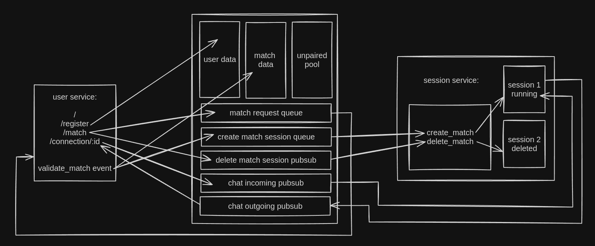
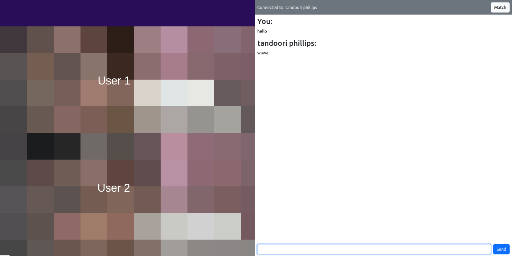

# Random Video Chat

Meet random people online.

## Tech Stack
- Echo framework (backend in Go)
- HTMX (server side rendering with Go templates)
- Redis (as messaging broker and database)
- Traefik (as layer 7 load balancer)

## Setup
You will need to add TURN_URL, TURN_USERNAME, TURN_CRED environment variable for user service.

```sh
# compose
docker compose up

# locally
git clone https://github.com/snwzt/random-video-chat.git
cd random-video-chat
go mod tidy
make build
make run-user
make run-session
```

## Working


## Demo
